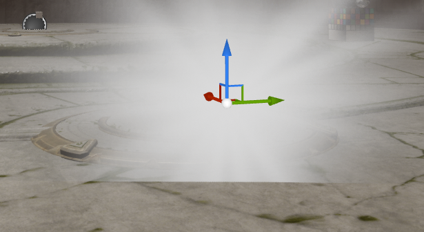
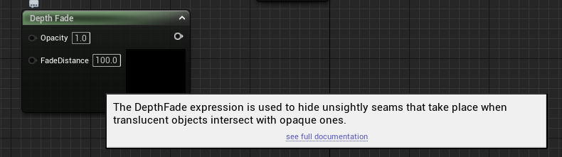
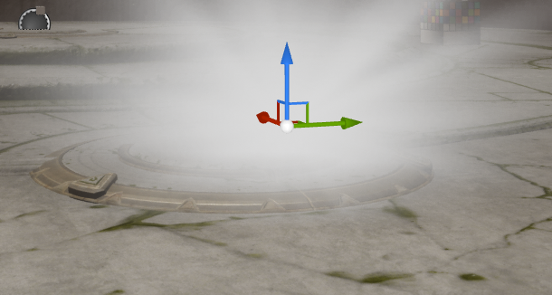
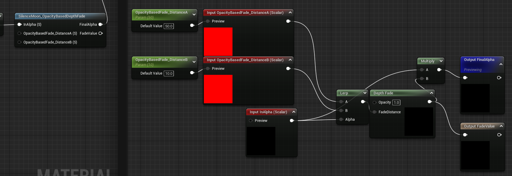
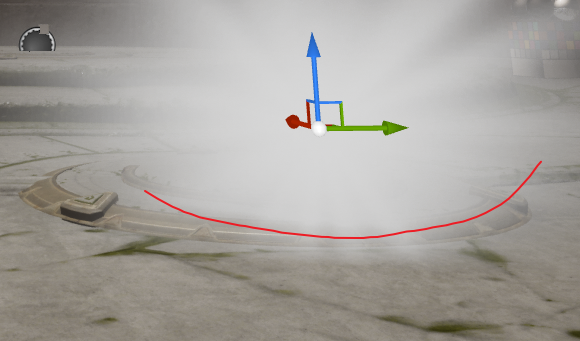
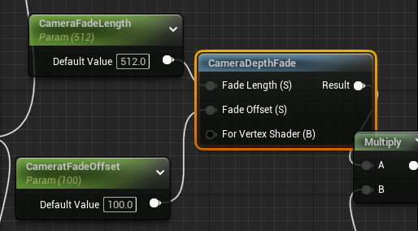
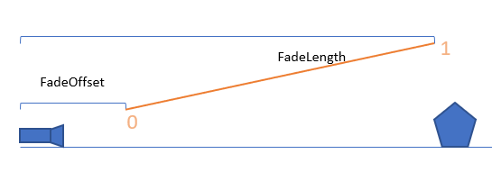

## 半透明材质与不透明对象生硬交界

一个半透明材质的面片与不透明物体相交，出现生硬的交界：

为避免这个问题，使用一个节点乘上透明度：

效果：

但是在从交界线网上是线性均匀地Fade，中间不透明部分和两边半透明部分Fade的程度都是一样的，我们更希望中间不透明部分Fade更慢一点。所以可以根据Alpha值Lerp一下Fade的距离：

Alpha大的时候，Fade Distance也小，Alpha小的区域，Fade的范围也就越大：

## 根据相机距离的透明度衰减

> :heavy_exclamation_mark:  UE中默认裁剪距离为24  

**Note**