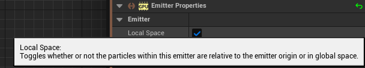
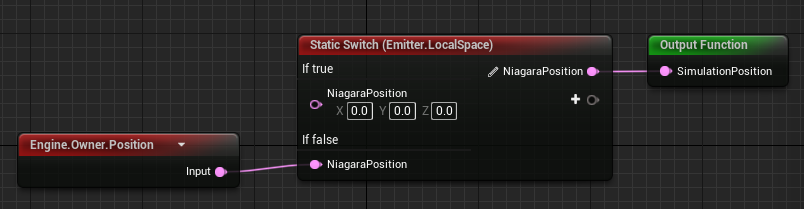
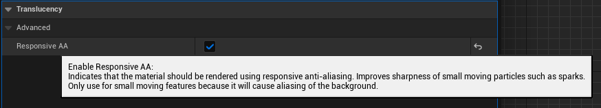

## Emitter - Local space 
Emitter中有一属性，表明粒子的计算是世界坐标还是Local坐标。

如果是World坐标，所有结果就应该是世界坐标下的结果。如果是本地坐标则应该是Local坐标结果。

在火花的Emiiter中，火花的中心：

* WorldSpace 应该是Owner的世界坐标位置(Engine.Owner.Position)
* LocalSpace 则应该是0

后一种情况则不应该直接用Owner.Position。而是直接设为0。Engine有提供这种节点：

## Curl noise force

Curl noise即是Perlin noise, 看起来更自然，会产生类似湍流的平滑和流动的图案。

Noise Strength：强度高，施加的力更大，单位时间跑得更远
Noise Frequency: f=1/T，频率高，周期小，变化越快，施加的力的方向就更乱，粒子的运动也更杂乱。频率低，周期大，力的方向变化不快，看起来粒子运动更有规律。

## 距离远了粒子看不到

是材质的问题，需要在材质中勾选这个：

